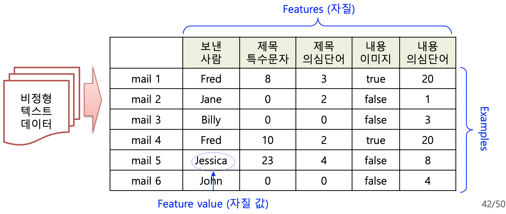
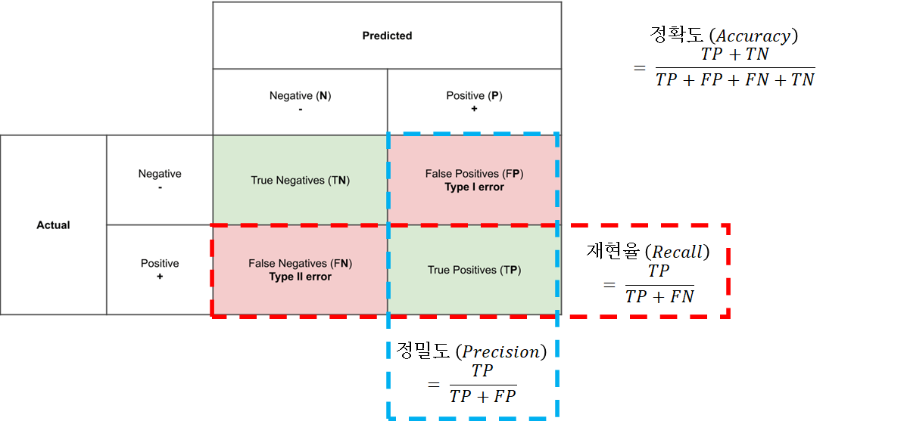

### [1.1] 기계학습의 정의
---
어떤 컴퓨터 프로그램이 T 라는 작업을 수행한다. 이 프로그램의 성능을 P 라는 척도로 평가했을 때 경험 E 를 통해 성능이 개선된다면 이 프로그램은 학습을 한다고 말할 수 있다. **"코드를 고치지 않는 것"**이 포인트이다.

### [1.2] 기계학습의 문제적 관점
---

- Classification (분류)
- Clustering (군집화)
- Generation (생성) - 새로 생김!

#### 분류와 군집화의 차이점

- 분류: 풀어야되는 범주가 정해져 있다. 데이터가 들어왔을 때 어떤 범주에 속하는지를 정하는 것이 분류이다. 
  - 5지선다형 문제 - 5개 선지가 각 범주에 해당
  - mite 사진이 들어왔을 때 mite일 확률 / black widow일 확률 / ... 등을 계산하여 범주를 분류하는 것.

- 군집화: 범주가 정해져있지 않다! 어떤 기준을 주고 그것에 따라 묶는 것

### [1.3] 기계 학습의 방법론적 관점
---
기계 학습의 학습 방법에 따라 지도학습, 비지도학습, 반지도학습으로 분류할 수 있다.

#### Supervised Learning (지도 학습)
정답이 부착된 데이터를 바탕으로 학습한다. 기계학습의 문제적 관점에서 분류 문제, 생성 문제가 이에 해당한다.
- 장점: 비지도 학습에 비해 성능이 좋음
- 단점: 정답을 데이터에 부착해야 하기 때문에 많은 시간과 노력이 듦 (데이터를 수십 ~ 수백만개씩 모아야 함)
- ex) 기사 분류, 영화평 예측, 기계 독해

> **기계 독해는 분류/군집화/생성 중 어디에 속하는가?**   
- 1번째 단어가 정답의 시작인가 아닌가? X
- 2번째 단어가 정답의 시작인가 아닌가? O 
- 3번째 단어가 정답의 끝인가 아닌가?  ...  
즉 이 문제는 Classification 문제이다! 이런 식으로 각 예시가 문제적 관점에서 어떤 종류인지 찾을 수 있어야 한다.
{: .prompt-tip }

#### Unsupervised Learning (비지도 학습)
클러스터링 문제가 여기에 속한다.

- 유클리드 거리, 코사인 유사도 등을 이용해 어떻게 계산하는지만 알려줌.
- 장점: 정답 부착 불필요해서 데이터 구축이 쉬움
- 단점: 지도 학습보다 성능이 낮음

#### Semi-Supervised Learning (반지도 학습)
지도 학습의 단점을 개선하기 위해 소량의 정답 부착 데이터로 모델을 만드는 것.

- 장점: 데이터 구축이 지도 학습보다 쉬움
- 단점: 지도 학습에 비해 성능이 낮지만 근접한 성능을 보임

능동 학습은 반지도 학습의 종류 중 하나지만, 이거 하나만 알고 있어도 된다.

> **능동 학습**  
10000개 중 100개만 정답 부착한 후 100개 학습 -> 9900개 데이터 테스트 -> 9900개 중 잘 못맞춘 데이터를 100개 골라서 정답 부착한 후 200개 학습 -> 9800개 중 잘 못맞춘 데이터를 100개 골라서 정답 부착한 후 300개 학습 -> ... 보통 5번 정도 하면 성능이 비슷해짐.
- 그럼 여기서 학습을 어려워할만한 문제 100개를 어떻게 고를것인가? 출력 결과를 보면 알 수 있다. 모든 결과를 20% 20% 20% 20% 20%로 예측하는 것은 구분을 잘 못한다는 의미이므로, 이런 사진을 학습시켜줄 것!
{: .prompt-tip}

최근에 생긴 Self-supervised Learning
- 정답을 하나하나 사람이 안줘도 되는 데이터셋
- ChatGPT: 현재 학습 단어 다음에 어떤 단어가 나오게 할지 학습하는 방법: 문장 전체를 줘버리면 된다.

### [1.4] 데이터 구성
---
- **훈련 데이터(80%) + 개발 데이터(10%) + 평가 데이터(10%)**
- 각 데이터들은 순서대로 가져와서는 안되고, **랜덤**하게 가져와야 한다.

1. **훈련 데이터(train set)**: 모델을 만들기 위해 사용되는 데이터
  - 만약 훈련 데이터로 평가를 한다면? 성능이 100% 나와야함. 이 성능이 안나오면 학습 자체가 안된것이다.
  - 처음 보는걸 잘 푸는 것이 목적이므로, 이미 학습한 것 가지고 평가를 하는 것은 의미가 없다.

2. **개발 데이터(dev set)**: 학습이 잘 되고 있는지 평가하기 위해 사용되는 데이터, 성능이 더 이상 올라가지 않을 때 학습을 마치기 위한 데이터
  - 개발 데이터로 학습을 했기 때문에 성능 평가를 하기 위해서는 평가용 데이터를 또 따로 만들어서 최종 학습이 필요하다. 

3. **평가 데이터(test set)**: 최종 학습된 모델을 평가하기 위해 사용되는 데이터
  - 마지막에 납품할 때는 모든 데이터를 다 골고루 학습시켜서 납품한다.

### [1.5] 지도 학습 모델 개발 절차
---
1. 데이터 수집
- 문제를 위한 데이터를 수집해야 한다. 대상 데이터(positivie data)와 비대상 데이터(negative data)를 균형 있게 수집해야 함. 
- ex) 스팸 메일인지 아닌지를 분류하려면? 스팸 메일(대상)과 비스팸 메일(비대상)을 골고루 모아야 한다. (비스팸 메일인지 아닌지를 분류하려면 비스펨 메일이 대상 데이터가 된다.)

2. 데이터 변환
- features (자질) 추출: 우리가 원하는 데이터 형태로 변환해야함. 이 능력이 매우 중요함!!
- 사람이 왜 스팸이라고 분류하는가? 이걸 정의할 수 있는 능력이 중요하다. ex) 스팸 메일에 자주 등장하는 단어를 가지고 있는지, url 개수가 많은지, 자주 스팸을 보낸 사람인지 등등

- 그러나, DNN이 나오면서 위의 전통적인 방식이 다 깨부셔짐. 자기 혼자서 메일을 보고 Feature 추출을 해낸다.

3. 모델 학습
- 이 문제는 어떤 모델로 푸는 것이 좋은지를 생각해서 모델을 잘 선택해야 한다.

4. 모델 평가
- Closed Test: 학습 데이터를 이용해 평가해서 학습이 되고 있는지 단순히 확인 (98~100% 나와야 한다)
- Development Test: Dev 데이터로 테스트하는 것. 올바른 방향으로 학습되고 있는지, 성능이 더이상 올라가지 않을 때까지 학습하기
- Open Test: 학습에 참여하지 않은 데이터를 이용한 평가

### [1.6] 모델 검증 방법
---
#### 10배 교차검증
- 100개 데이터 중 최종 데이터 제외 90개를 10등분 해서 1번이 1-10번째 데이터, 2번이 11-20번째 데이터, ... 라 하자.
- 1-9번까지를 train데이터, 10번을 Dev 데이터로 사용
- 2-10번까지를 train 데이터, 1번을 dev 데이터로 사용
- 1, 3-10 번까지를 train 데이터, 2번을 dev 데이터로 사용
- ...
이와 같이 10번 시행을 해서 그 평가의 평균값을 모델의 성능으로 사용한다.

#### 평가 척도 
- **TN** - True negative: 예측이 정답이며, 실제 답이 0
- **FP** - False positive: 예측이 오답이며, 실제 답이 0
- **FN** - False negative: 예측이 오답이며, 실제 답이 1
- **TP** - True positive: 예측이 정답이며, 실제 답이 1

- Accuracy (정밀도): 전체 중 예측이 정답인 비율
- Precision (정확률): 우리 시스템이 1이라고 한 것 중 정답인 비율
- Recall (재현율): 실제 답이 1인 것 중 우리 시스템이 예측이 정답인 비율
- 정확률과 재현율이 반비례 관계이다. 임의로 재현율을 높이고 싶으면? 전부 1이라고 하면 재현율은 100%지만 정확률이 낮아짐. 따라서 두 개를 적절히 봐야 한다.
- F1-score: 정확률과 재현율의 조화평균 

$$F1\ score\ =\ \frac{2 * precision * recall}{precision + recall}$$

### 파이썬 실습
---
pip가 최신 버전인지 확인해서 업그레이드해야함

코랩
- 영어 폴더 생성
- 내 구글 드라이브와 코랩을 마운트시키는법
- ipynb 파일 실행시켜서 저장해서 제출하기! 제목 양식도 지키기
- 실습예제1.txt 내용: 강의계획서의 내용과~ 부분으로 바꿔서 출력해서 내기.

